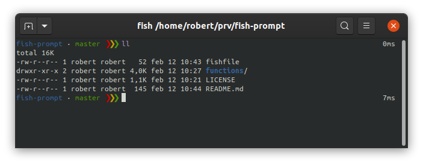

# Fish prompt



A minimal prompt with nice git support. 

## Prerequisites

- Fish shell (https://fishshell.com) 
- Fisher (https://github.com/jorgebucaran/fisher)

## Install

```[bash]
fisher install devghost/fish-prompt
```

## Dependencies

fishpkg/fish-segment  
fishpkg/fish-humanize-duration
